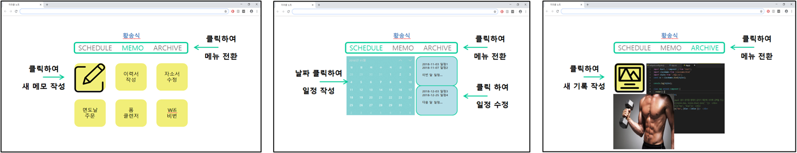
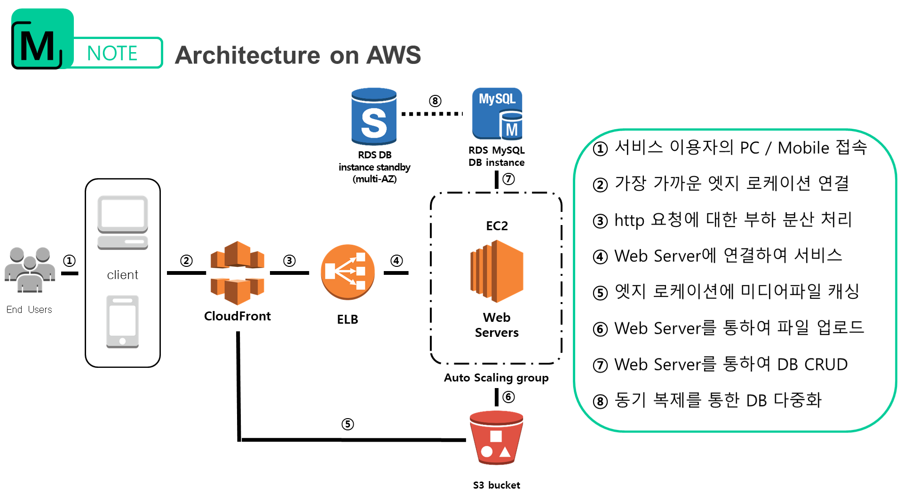

# Miracle Note
Mnote prototype of Miracle Project (2018.11 ~ 2018.11)

본 프로젝트는 클라우드 컴퓨팅 서비스인 아마존 웹 서비스를 이용하여 설계/제작된 웹 서비스입니다.
최적의 접근성과 편의성을 갖춘 서비스를 통해 자기 개발 실현의 기회를 제공하는것이 본 서비스의 목적으로
포스트 메모 / 일정 관리 / 성과 및 업적 기록 의 세 가지 기능을 사용해 보실 수 있습니다.

M-note is a web service platform designed and built using a cloud computing service called Amazon Web Services (AWS). 
A project with the sole purpose of providing an accessible tool for individuals to focus on self-development, planning, and organization with ease and convenience by using the main functions: Post Memo, Schedule, Achievement Record.

http://13.209.74.48:3000/

# 개발 Developers
 - 강경한 Kang Kyung Han (Front-end : JavaScript, CSS)
 - 황송식 Hwang Song Sik ( Back-end : Node.js, MySQL, Amazon Web Services)

# 도움 Special thanks to
 - 이하규 Lee Ha Kyu
 
# 환경 Environment
- Server : Amazon Elastic Compute Cloud (AWS EC2 Ubuntu)
- Storage : Amazon Simple Storage Service (AWS S3)
- Database : Amazon Relational Database Service (AWS RDS MySQL)

# 사용법 Usage
- AWS 가입 및 인스턴스 생성 및 초기화 작업 
  SignUp to AWS and make instances and initiate them. (EC2, RDS, S3 Bucket)
  
- EC2 인스턴스에 프로젝트 폴더 복사
  Copy this project folder to EC2 instance.
  
- EC2 인스턴스에 Node.js 설치
  Install Node.js in EC2 instance.

- 'usage.txt' 파일을 참고하여 약간의 소스코드 수정
  Modify some source code by referring to 'usage.txt'
  
- 프로젝트 폴더에서 npm install 명령어 실행
  Run 'npm install' in project folder
  
- 프로젝트 폴더에서 node app.js 명령어 실행
  Run 'node app.js' in project folder
  
# 부족한 점 Insufficient Point
- 세션 로그아웃 미구현 
  No Session logout
- 성과 및 업적 기록 기능에 동영상 기능 미구현 
  You Can't upload Videos yet in Archive function
- 일정 관리 기능 버그 존재 
  There are Some bugs in Schedule function
